### ** LDO Micron+ Colony Clacker kits are now available, speak to your local vendor for availability! **

# 🐜 Colony Clacker

*A satisfyingly clicky door upgrade for your Printers for Ants colony—because even tiny printers deserve a proper "clack"!*

   &nbsp;

   &nbsp;

   &nbsp;

   &nbsp;

  

## Table of Contents

- [🚪 What is Colony Clacker?](#-what-is-colony-clacker)
- [📦 Bill of Materials](#-bill-of-materials)
- [📐 Door Parts](#-door-parts)
- [Print Recommendations](#print-recommendations)
- [Latch Variants](#latch-variants)
- [Handle_C Logo Variants](#handle_c-logo-variants)
- [🛠️ Assembly Instructions](#️-assembly-instructions)
- [🎨 Optional Skirts](#-optional-skirts)
- [Feedback & Discussion](#feedback--discussion)
- [Raising Issues](#raising-issues)
- [📜 Version History](#-version-history)

---

## 🚪 What is Colony Clacker?

Inspired by the popular [Clicky-Clack Fridge Door](https://github.com/tanaes/whopping_Voron_mods/tree/main/clickyclacky_door) mod by tanaes, **Colony Clacker** is specially designed for Printers for Ants (PFA), and other 1515 based printers.

Completely remodeled from scratch (not just scaled), it boasts enhanced stealthy aesthetics, improved tolerances, and optimized STLs for top quality printing using standard Voron settings.

[Watch the satisfying Clack in action!](https://youtube.com/shorts/yi75DsFQ0eI?si=P8Z4A60wTr4WiRiI)

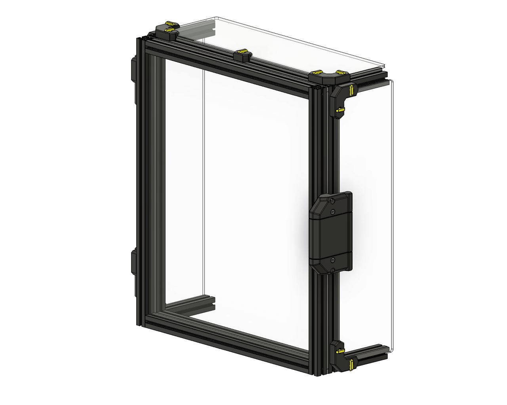
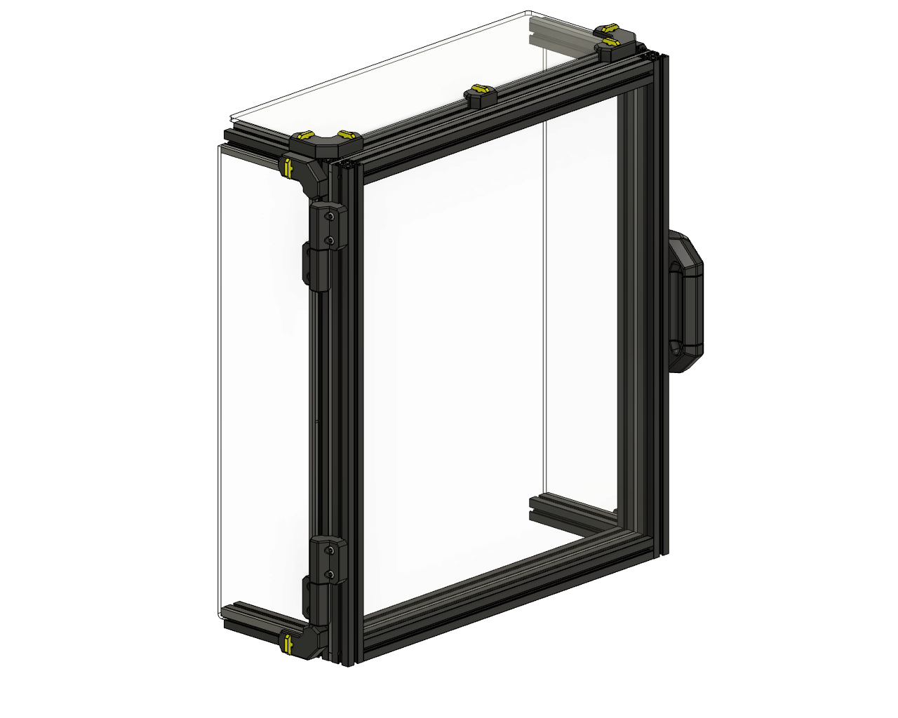
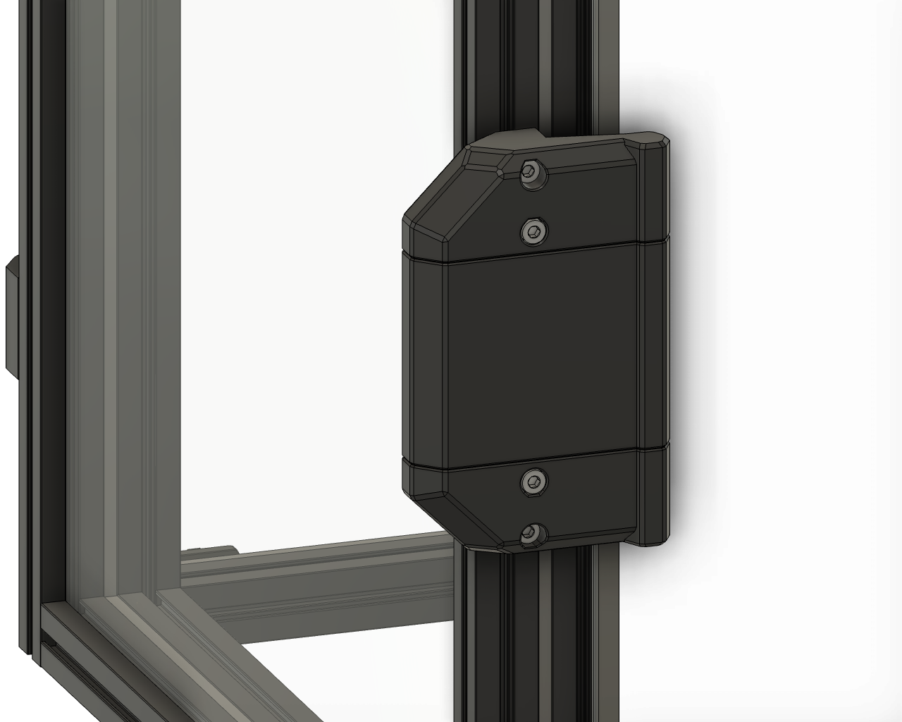

---

## 📦 Bill of Materials
*If you intend to use the optional extended skirts, additional hardware for these is listed further down the page, in the corresponding skirt sections.*

### 🛠️ Hardware
| Qty   | Item  | Notes  | Purchase Links  |
| :---: | :---- | :----- | :-------------- |
| 4     | M3x8 BHCS | For blind joints | [Aliexpress](https://s.click.aliexpress.com/e/_Exdxtsp) |
| 10    | M3x12 BHCS |  | [Aliexpress](https://s.click.aliexpress.com/e/_Exdxtsp) |
| 4     | M3x16 SHCS |  | [Aliexpress](https://s.click.aliexpress.com/e/_EGPNidr) |
| 2     | M3x20 SHCS |  | [Aliexpress](https://s.click.aliexpress.com/e/_EGPNidr) |
| 14    | M3 Hex Nut |  | [Aliexpress](https://s.click.aliexpress.com/e/_EwEY3Rf), [Amazon](https://amzn.to/3NtQHXi) |
| 4     | M5 x 7mm x 8mm Split Bushing |  | [Aliexpress](https://s.click.aliexpress.com/e/_EvcAzIV), [Amazon](https://amzn.to/3Yrq8rT) |
| 4     | 5mm x 40mm Dowel Pin |  | [Aliexpress](https://s.click.aliexpress.com/e/_Ex91QWD), [Amazon](https://amzn.to/40eAuNr) |
| 8     | 6mm x 3mm N52 Magnet |  | [Aliexpress](https://s.click.aliexpress.com/e/_EIDUzuD), [Amazon](https://amzn.to/3YqHEga) |
| 1.3M  | 3mm Foam Tape | 2.5M required for double seals | [Aliexpress/Amazon](https://s.click.aliexpress.com/e/_EzqH685) |
| 4     | Micron R1 Twist Lock Key | Printed component | [STL File](https://github.com/PrintersForAnts/Micron/blob/main/STLs/Panels/%5Ba%5D_twist_lock_key_x50.stl) |

> ### *Note* - LDO Rev1 kits will be shipped with M3x12 BHCS for the blind joints, these may need swapping out for M3x8 BHCS if the threads seem tight part way through.

## 📐 Door Parts

### Micron+
| Qty   | Item |
| :---: | :---- |
| 2     | 350mm 1515 Aluminium Extrusion |
| 2     | 280mm 1515 Aluminium Extrusion |
| 1     | 3mm Acrylic or PC Panel - 330mm x 290mm |

### StealthFork 180
| Qty   | Item |
| :---: | :---- |
| 2     | 400mm 1515 Aluminium Extrusion |
| 2     | 290mm 1515 Aluminium Extrusion |
| 1     | 3mm Acrylic or PC Panel - 380mm x 300mm |

### StealthFork 160
| Qty   | Item |
| :---: | :---- |
| 2     | 400mm 1515 Aluminium Extrusion |
| 2     | 270mm 1515 Aluminium Extrusion |
| 1     | 3mm Acrylic or PC Panel - 380mm x 280mm |

*Extrusions & hardware available at [DLLPDF](https://www.dllpdf.com/colony-clacker).*

---

## Print Recommendations

**All STLs are oriented for printing.**

- **Material:** ABS or ASA
- **Layer height:** 0.20 mm (including first layer)
- **Wall count:** 4
- **Extrusion width:** 0.40 mm (forced)
- **Top/bottom solid layers:** 5
- **Infill:** 40% (Grid, Gyroid, Honeycomb, Triangle, or Cubic)
- **Supports:** Not required

---

### Latch Variants

Provided in multiple offsets to suit different panel/foam thicknesses. The required frame‑to‑door distance is embossed on the back of each STL (e.g., **6** = **6 mm**).

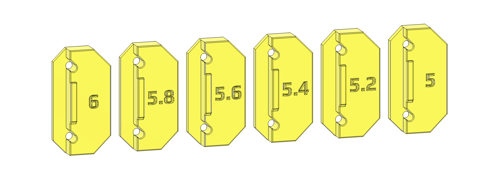

---

### Handle_C Logo Variants

Handle_C versions are available with logos from various brands and printers, allowing you to customise your build.

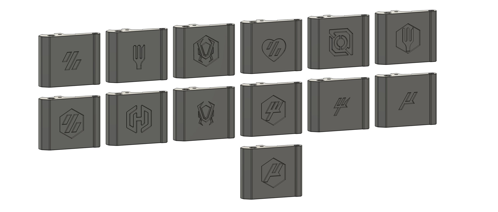

---

## 🛠️ Assembly Instructions
Assembly is intuitive. Use the provided images for visual guidance if you encounter difficulties.

**Important:**
- Superglue magnets securely into the latch and corresponding handle piece
- Hardware locations can be seen in the assembly images below.
- On initial build, you may experience less clacking, this is usually due to the foam needing to settle, or the 2x screws in the latch being too tight.

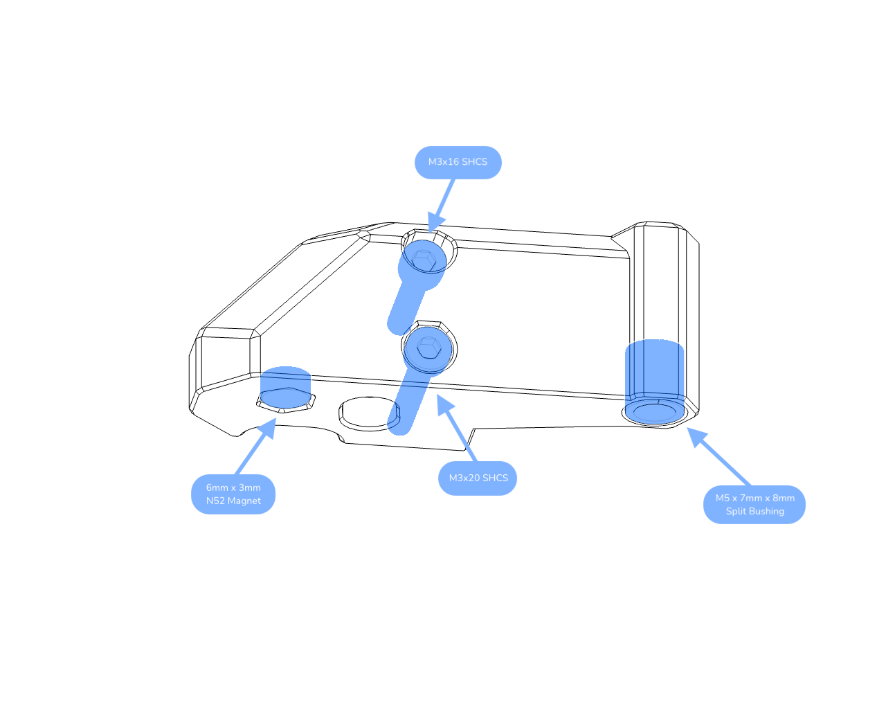
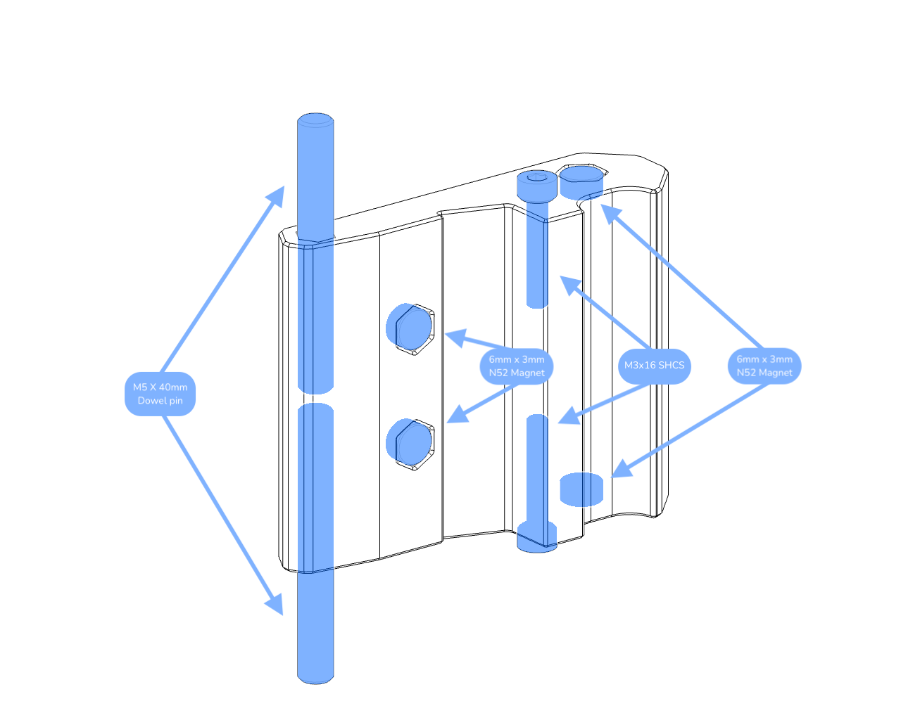
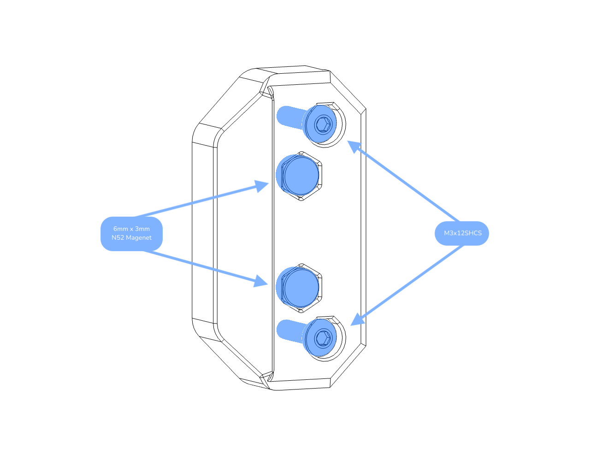
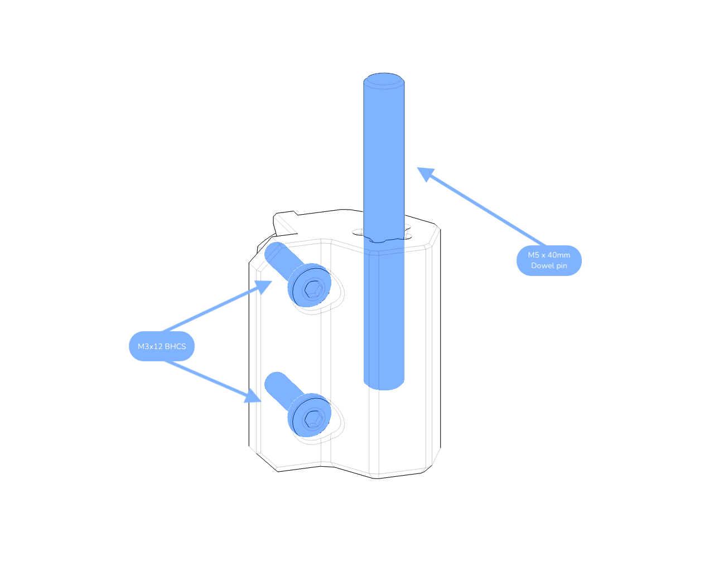
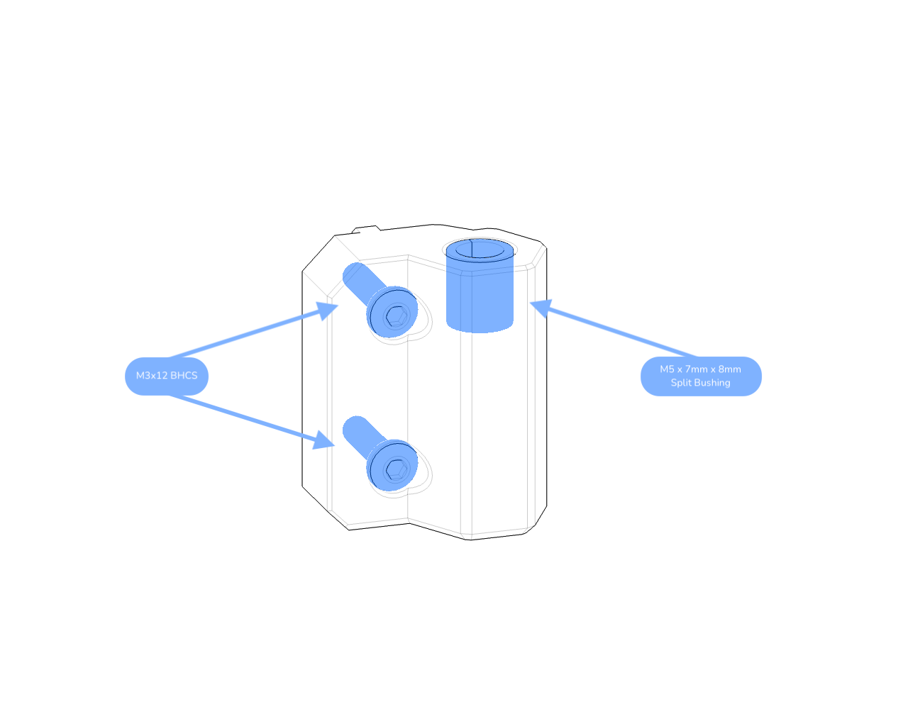

---

## 🎨 Optional Skirts 
There are currently some extended skirts for the following PFA Printers.
Improving the overall aesthetic and screen access.
(Others will be added as they are created)

**Micron+ (G2Z)**  

| Qty   | Additional Hardware     |
|:-----:|:------------------------|
| 2     | M3x5x4 Heatset Insert   |
| 2     | M3x8 BHCS               |

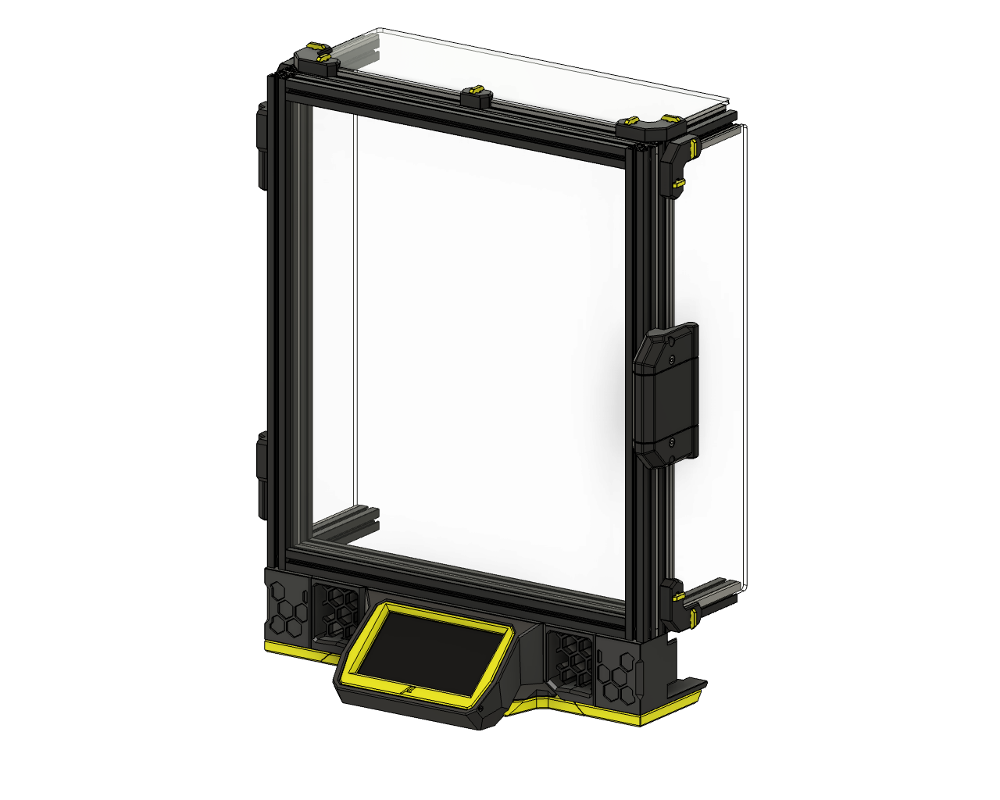

**Micron+ (Stock Z)**

| Qty   | Additional Hardware     |
|:-----:|:------------------------|
| 4     | M3x5x4 Heatset Insert   |
| 4     | M3x8 BHCS               |
| 8     | M2x10 STS               |

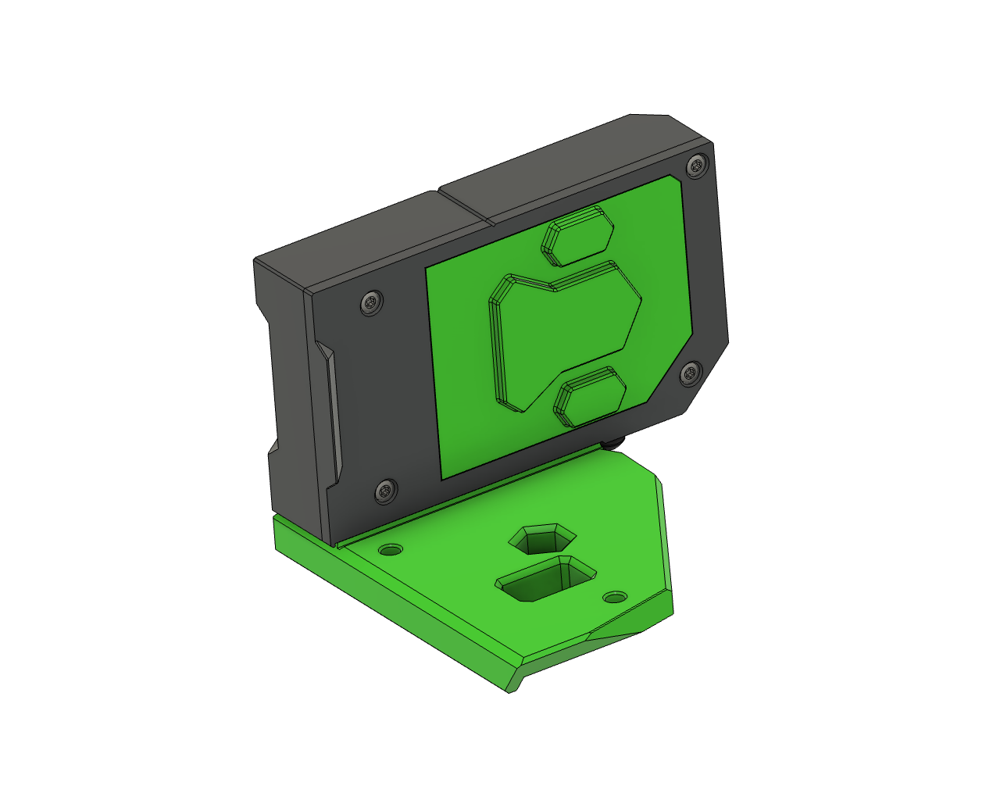

**StealthFork**

| Qty   | Additional Hardware     |
|:-----:|:------------------------|
| 4     | M3x5x4 Heatset Insert   |
| 4     | M3x8 BHCS               |

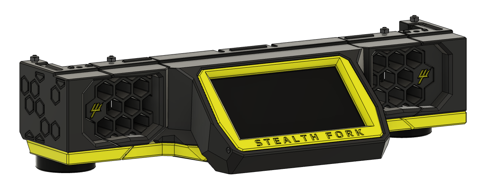

---

## Feedback & Discussion  

If you're building a Colony Clacker, I'd love to hear your thoughts! 

Join the discussion, suggest improvements, or share feedback in the 'KyleGB' channel on the Doomcube Discord.  

---

## Raising Issues
If you encounter any issues, please report them via the Issues section on the Git repository. 

Be as detailed as possible, include steps to reproduce, and relevant images or screenshots. 

Your feedback helps improve Colony Clacker for everyone!

---

## 📜 Version History

| Date       | Change Details                                                |
|------------|---------------------------------------------------------------|
| 09-Aug-25  | Added new latch, updated for better printability with variants for panel distnce. Added Handle_C logo variants. CAD updated with LDO extrusions to match kits.
| 24-May-25  | Added StealthFork 160 & 180 Skirts Added TFT35 Display Mount Moved Micron+ Stock Z Skirts CAD to archive
| 22-Mar-25  | Fixed missing heatset hole on `skirt_main_body.stl`, relocated screw for better clearance from M2x10 STS (Thanks dajones89) 
| 21-Mar-25  | Added Micron R1 Stock Z Skirts. Added v1.1 of Micron+ G2Z skirts - 2mm clearance added for door. Moved v1 files to archive folder.
| 13-Mar-25  | Clean-up `readme.md` |
| 12-Mar-25  | Fixed Issue [#1](https://github.com/PrintersForAnts/ColonyClacker/issues/1) |
| 17-Oct-24  | Added Larger Surface Area latch variants; Corrected hardware details |
| 10-Oct-24  | Added missing chamfers; Improved STL naming clarity          |
| 08-Oct-24  | Initial Release 🎉                                             |

---

Enjoy your clicky-clacking Colony Clacker! 🐜✨
